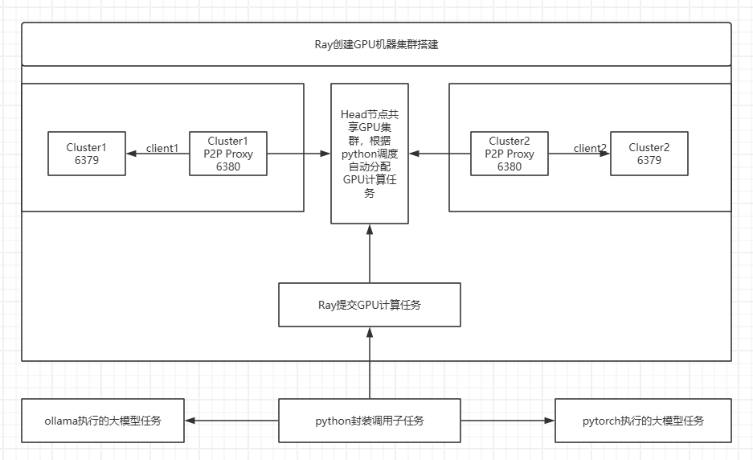

# 利用libp2p+Ray+ollama构建共享去中心化GPU 调用大模型
## Ray 是基于python的 GPU集群运算框架 [https://github.com/ray-project/ray](https://github.com/ray-project/ray)
## 总体架构

## 1.环境准备
- 客户端环境拥有用 nvidia GPU,CUDA
- ollama 安装 [https://ollama.com/download](https://ollama.com/download)
- `nvidia-smi.exe -l` || `nvidia-smi -l` 验证
```bash
# conda create --name p2pray python=3.12.3
# conda activate p2pray
# python -V
# Python 3.12.3
# pip install 'ray[default]'
# ray --version
# ray, version 2.44.0
```
## 2.启动head节点
```bash
# ray start --head --node-ip-address=172.20.133.120 --port=6379 --dashboard-host=172.20.133.120 --dashboard-port=8265
# 查看状态
# ray status
# 停止ray服务
# ray stop
# 查看控制面板
# http://172.20.133.120:8265
```
## 2.启动cluster worker节点
```bash
# Windows 设置
# $env:RAY_ENABLE_WINDOWS_OR_OSX_CLUSTER=1
# Mac
# export RAY_ENABLE_WINDOWS_OR_OSX_CLUSTER=1
# ray start --address='(head节点ip):6379' --node-ip-address=192.168.0.107 
```
## 3.由于本机机器没有固定IP服务，所以需要借助libp2p 做内容转发服务
```bash
# 编译当前项目
# go build
```
## 4.启动rayp2p 代理服务,并重新启动ray节点 3-4两步可以集成至qng服务，当前只是测试
```bash
# 对于head节点只需要启动proxy
#./rayproxy
# 对于worker节点 需要创建与head节点的连接
# .\rayproxy.exe --peer /ip4/172.20.133.120/tcp/42895/p2p/12D3KooWCVb84GmLUpV1uwc6uHKsJxj8JHTwJiNshmTj3pjBeque --localproxy 192.168.0.107:6380
# worker 节点ray重新启动
# ray start --address='192.168.0.107:6380' --node-ip-address=192.168.0.107
# ray status 查看状态
```
## 5.提交任务
```bash
# ray job submit --address http://172.20.133.120:8265 --working-dir . -- python task.py
```
## 6.大模型任务
```bash
# ollama pull llama3.2
```
## 7.python 执行ollama命令 run_ollama.py
```python
import subprocess
import ray
# import sys
# sys.setdefaultencoding('utf-8')

themes = ["写一篇关于AI大语言模型对比的分析",
"写一篇AI未来发展的文章","写一篇关于zig编程语言的教程",
"AI在区块链中的应用"]

@ray.remote(num_gpus=1) #使用的gpu数量
def call_with_ollama(model,input):
    # 构造命令，假设 Ollama 支持传入训练数据和输出路径
    cmd = f'ollama run {model} "{input}"'
    result = subprocess.run(cmd, shell=True, capture_output=True, encoding="utf-8", text=True)
    if result.returncode != 0:
        raise RuntimeError(f"任务 {model} {input} 失败: {result.stderr}")
    return f"任务 {model} {input} 成功: {result.stdout}"

ray.init()

# 假设有4个任务，每个任务处理不同的数据批次
tasks = [call_with_ollama.remote("llama3.2", f"{themes[i]}") for i in range(4)]
results = ray.get(tasks)
for res in results:
    print(res)
ray.shutdown()

```
## 8.提交调用大模型任务
```bash
# Ubuntu
# ray job submit --address http://172.20.133.120:8265 --working-dir . -- python run_ollama.py
# Windows
# # ray job submit --address http://172.20.133.120:8265 -- python run_ollama.py
```
## 9.模型并行训练调用示例
```python
import ray
from ray.train.torch import TorchTrainer, TorchConfig
import torch
import torch.nn as nn
import torch.optim as optim
from torch.nn.parallel import DistributedDataParallel as DDP

def train_func(config):
    import torch.distributed as dist
    dist.init_process_group(backend="nccl")
    device = torch.device("cuda:0")
    model = nn.Linear(10, 10).to(device)
    ddp_model = DDP(model, device_ids=[0])
    optimizer = optim.SGD(ddp_model.parameters(), lr=0.001)
    for epoch in range(5):
        x = torch.randn(32, 10).to(device)
        output = ddp_model(x)
        loss = output.mean()
        optimizer.zero_grad()
        loss.backward()
        optimizer.step()
        print(f"Epoch {epoch}, Loss: {loss.item()}")
    dist.destroy_process_group()

trainer = TorchTrainer(
    train_loop_per_worker=train_func,
    scaling_config=ray.train.ScalingConfig(num_workers=4, use_gpu=True),
    torch_config=TorchConfig(backend="nccl")
)
trainer.train()
ray.shutdown()

```